# Cara penggunaan github
Cara penggunaan github untuk berkolaborasi mengelola pekerjaan

1. [Untuk Kontributor](#untuk-kontributor)

2. [Untuk non Kontributor](#untuk-non-kontributor)

3. [Menggabungkan Dua Repository](#menggabungkan-dua-repository)

3.1. [Menggunakan Version](#menggunakan-version)

3.2. [Menggunakan Upstream](#menggunakan-upstream)

4. [Menggabungkan Dua Branch](#menggabungkan-dua-branch)


## Untuk Kontributor
### 1. git clone

Perintah "**git clone**" digunakan untuk mengunduh code yang ada pada repository.

**git clone < repository yang akan di gunakan >**

**contoh penggunaan perintah "git clone":**
```bash
$ git clone https://github.com/bantenprov/advancetrust.git
$ cd advancetrust/
```

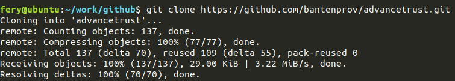

### 2. git pull
Perintah git pull ini akan sering kali digunakan apabila kita dalam bekerja membuat suatu aplikasi atau mengembangkan aplikasi secara tim.

**contoh penggunaan git pull**
```bash
$ git pull origin master
```
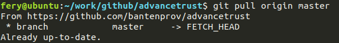

<br><br>
Setelah berhasil menjalankan perintah **git clone**, di sini akan di contohkan bagaimana menambahkan folder baru yang di beri nama **flowchart**

```bash
$ mkdir flowchart
```
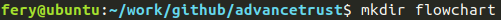

setelah menjalankan perintah diatas maka akan ada folder baru dengan nama **flowchart**, selanjutnya berpindah ke folder / directory yang telah dibuat tadi, dengan menggunakan perintah:

```bash
$ cd flowchart
```
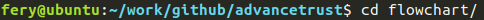

setelah berada di folder / directory "**flowchart**", pada contoh ini akan mencoba menambahkan file baru yang di beri nama "**.gitignore**" dengab cara menjalankan perintah seperti di bawah ini:

```bash
$ echo "" > .gitignore
```
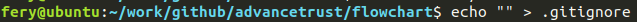

jika berhasil maka akan ada file baru dengan nama "**.gitignore**", untuk melihat file yang telah berhasil di buat tadi jalankan perintah berikut:

```bash
$ ls -la
```
maka akan terlihat seperti gambar berikut:

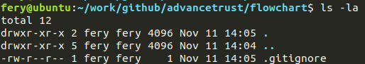

sampai pada langkah ini kita telah berhasil menambahkan folder "**flowchart**" dan di dalam folder tersebut telah ada file "**.gitignore**"

berikutnya kita akan update folder dan file yang sudah di buat tadi ke repository yang di clone di awal tadi dengan cara kita kembali ke folder awal yang di clone tadi dengan perintah berikut:

### 3. git add
Dengan menggunakan perintah ini, maka artinya sama aja kita menyuruh agar di git untuk melakukan penambahan (add) pada semua file dalam folder


```bash
$ cd ../
$ git add flowchart/
$ git status

```
jika semua berhasil dan tidak ada masalah maka akan tampil seperti gambar berikut:


perintah selanjutnya

```bash

$ git commit -m "<isi pesan>"

```

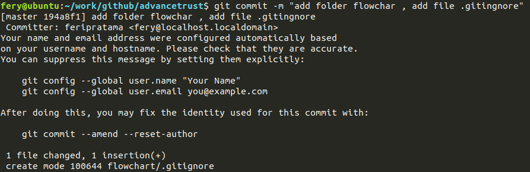

### 4. git push
 **git push** adalah memasukkan file-file atau direktori hasil kerjaan kita yang dilakukan setelah melakukan commit ke tempat penyimpanan projeknya (misal dalam kasus ini adalah github).

terakhir kita akan menjalankan perintah **git push**

```bash
$ git push origin master
```
jika tidak ada error maka akan tampil seperti gambar berikut:

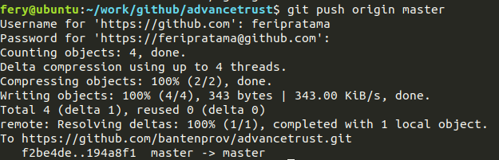


> patch yang dikirim baru akan tampil pada repository jika sudah di commit

## Untuk non Kontributor

### 1. Fork
Fork terlebih dahulu repository yg ingin di patch.

Klik tombol fork


### 2. Copy link untuk clone

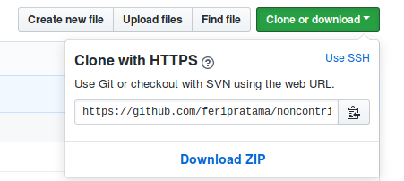

lalu jalankan perintah ini:

**git clone < url clone>**

```bash
$ git clone https://github.com/feripratama/noncontrib.git
```

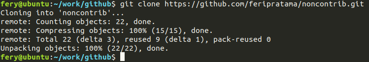

setelah itu pindah ke folder / directory yang telah di clone

```bash
$ cd noncontrib
```


setelah di dalam directory **noncontrib** (sesuaikan dengan directory yang ada)

tambahkan file baru pada local repository, dengan mejalankan perintah seperti berikut:

```bash
$ echo "" > newFile.php
```
atau tambahkan file yang anda ingin upload dari folder lain, misalkan nama foldernya adalah "folder-asal" (sesuaikan path folder-asal tersebut apa perintah dibawah ini:

```bash
$ cp -R ../folder-asal  .
```

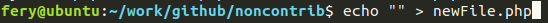

jika tidak ada error, maka lanjutkan lagi dengan mengetikkan perintah **git add**:

```bash
$ git add -A
$ git status
```

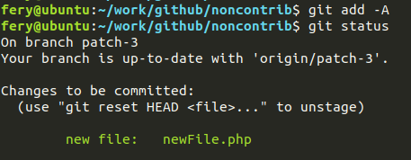

jika menambahkan file seperti contoh diatas, maka terlihat ada penambahan file baru " **newFile.php** "

lanjut tambahkan branch baru pada repository dengan perintah sebagai berikut:

```bash
$ git checkout -b patch-5
```

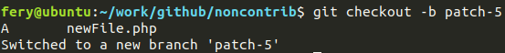

sejauh ini kita telah berhasil menambahkan file baru dan menambahkan branch **patch-5**

lalu lanjut mengetikkan perintah **git commit**

```bash
$ git commit -m "add newFile.php"
```
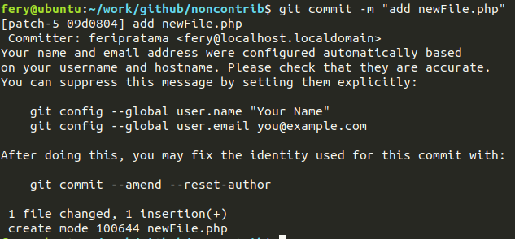

jika berhasil maka tampilan seperti gambar di atas
maka lanjutkan dengan mengetikkan perintah **git push**

```bash
$ git push origin patch-5
```

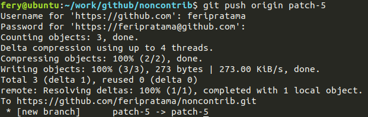

setelah semua berhasil, buka repository yang di fork di awal tadi


terlihat ada notice patch-5 sama seperti nama branch yang kita tambahkan tadi, lalu klik tombol **Compare & pull request**

setelah tombol **Compare & pull request** di klik maka akan di bawa ke halaman Pull request.

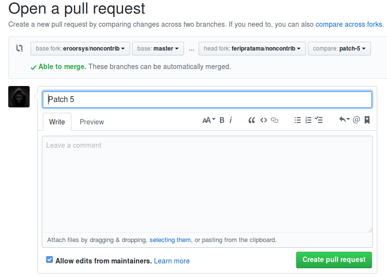

lalu klik tombol **Create pull request**

jika berhasil maka tampilan akan terlihat seperti gambar di bawah:

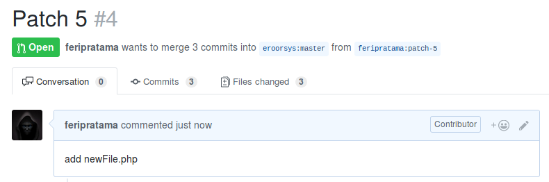

## Menggabungkan Dua Repository
Pada bagian ini kita menggabungkan repository yang kita miliki dan berasal dari fork repository utama.

### Menggunakan Version
#### jalankan git remote add
*misalkan kita alias yang akan gunakan sebagai remote repository adalah: version-02 dan repo yang akan di remmote untuk digabungkan adalah https://github.com/bantenprov/dashboard-epormas.git*

```bash
git remote add version-02 https://github.com/bantenprov/dashboard-epormas.git

```
#### kemudian jalankan git pull
kalau tadi kita menggunakan *version-02* untuk alias maka perintahnya menjadi:

```bash
git pull version-02 master
```
#### git status

```bash
git status
```
#### git add -A
untuk menambahkan semua perubahan yang terjadi
```bash
git add -A
```
#### git commit
untuk menambahkan semua perubahan yang terjadi
```bash
git commit -m "gabungkan dua repo"
```
#### git push
untuk mengirimkan perubahan yang sudah di commit ke git repo dengan branch *version-01*, lakukan
```bash
git push version-01
```

### Menggunakan Upstream
#### jalankan git remote add
*misalkan kita alias yang akan gunakan sebagai remote repository adalah: upstream dan repo yang akan di remmote untuk digabungkan adalah https://github.com/bantenprov/document-management-system.git*

```bash
git remote add upstream https://github.com/bantenprov/document-management-system.git

```
#### kemudian jalankan git pull
kalau tadi kita menggunakan *upstream* untuk mengambil perubahan yang terjadi di repo asli agar tidak terjadi konflik. Penggunaan *--rebase* berfungsi untuk memodifikasi riwayat commit yang sudah ada. Sebagai contoh, rebase dapat dipakai untuk menggantikan merge. Walaupun memberikan hasil yang sama, keduanya memiliki "efek samping" yang berbeda. Operasi merge akan menghasilkan commit baru sementara rebase tidak! Dengan demikian, rebase menghasilkan riwayat yang lebih rapi tanpa percabangan.

```bash
git pull --rebase upstream master
```
#### git status

```bash
git status
```
#### git add -A
untuk menambahkan semua perubahan yang terjadi
```bash
git add -A
```
#### git checkout dan patch
untuk mengecek ada tidaknya patch yang ingin dipakai dan membuat patchnya
```bash
git checkout -b patch-1
```
#### git commit
untuk menambahkan semua perubahan yang terjadi
```bash
git commit -m "gabungkan dua repo"
```
#### git push
untuk mengirimkan perubahan yang sudah di commit ke git repo dengan branch *version-01*, lakukan
```bash
git push origin patch-1
```
## Menggabungkan Dua Branch
catatan ini bertujuan menggabungkan salah satu branch ke dalam master
```bash
git checkout master
git merge dev
```
